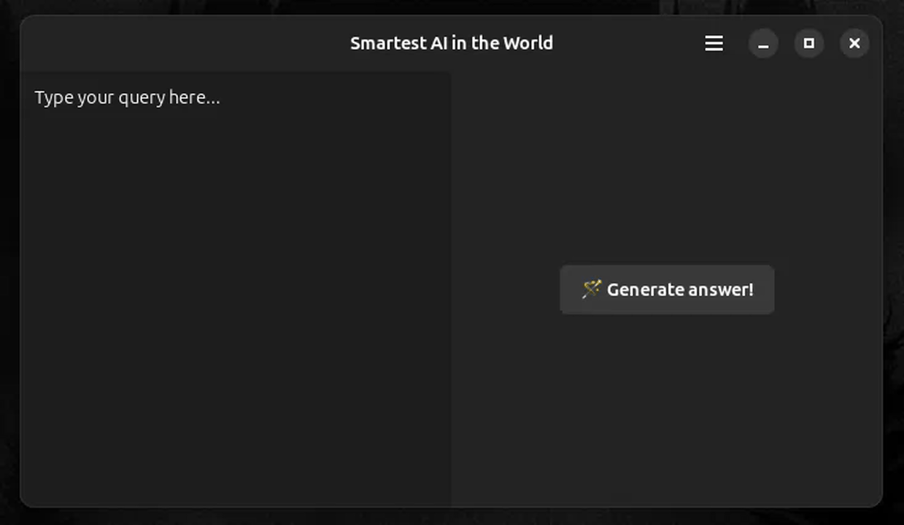

# SmartestAI



## About

**SmartestAI** is a revolutionary application that knows the answers to all questions! 🤖✨

Finally, the perfect AI assistant has been created that can solve any of your problems. Just type your question and press the "Generate Answer" button — and magic will happen!

> ⚠️ Warning: This is a humorous application! SmartestAI is a playful demonstration of how a "smart" AI can be as elusive as the answers to life's important questions. The button will run away from your cursor, symbolizing humanity's eternal quest for knowledge. 😄

## Features

- 🧠 "Knows" the answers to **all** questions
- 🏃 Interactive interface with an evasive button
- 🎯 Trains your coordination and patience
- 🎨 Beautiful interface based on GTK4/Libadwaita
- 😂 Guaranteed entertainment

## Installation

### Dependencies

To build the application you will need:
- GTK4
- Libadwaita
- Vala compiler
- Meson build system

### Building from Source

```bash
meson setup builddir
meson compile -C builddir
meson install -C builddir
```

### Flatpak

You can also build the application as a Flatpak:

```bash
flatpak-builder --user --install --force-clean build-dir com.datapeice.smartestai.json
```

## Usage

1. Launch the application
2. Enter your most important question in the text field
3. Try to click the "Generate Answer" button
4. Repeat step 3 until you understand the deep philosophical meaning 🧘

## Technologies

- **Language:** Vala
- **UI Framework:** GTK4 / Libadwaita
- **Build System:** Meson
- **Packaging:** Flatpak

## License

This project is distributed under the MIT license. See the [COPYING](COPYING) file for details.

## Author

Copyright (c) 2025 Illia Datsiuk

---

*Remember: the smartest AI is the one that knows when to run away from silly questions!* 🏃‍♂️💨
